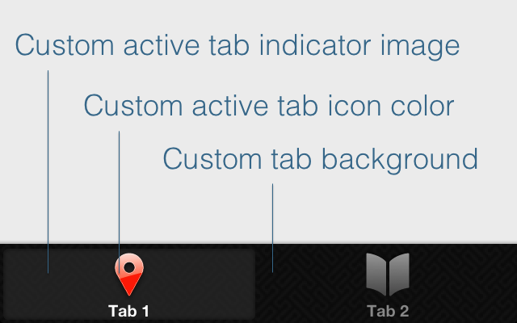

# TiExtendTab module for iPhone



**This module is no support.**

## Usage

See `example/app.js`

## Feature

* Custom active tab indicator image
* Custom active tab icon color
* Custom tab background image
* Custom tab background color (Same Ti.UI.TabGroup.tabsBackgroundColor property)

```
var tabGroup = Ti.UI.createTabGroup({
    customBackgroundColor: "#151515",
    customBackgroundImage: "pw_maze_black.png",
    customActiveIndicator: "activeIndicator.png",
    customActiveIconColor: "#FF3300"
});
```

It is not possible that you enable only one of the "`customActiveIconColor`" in the case, "`customBackgroundColor`" to use in iOS 7 this module.

## License

See `LICENSE`